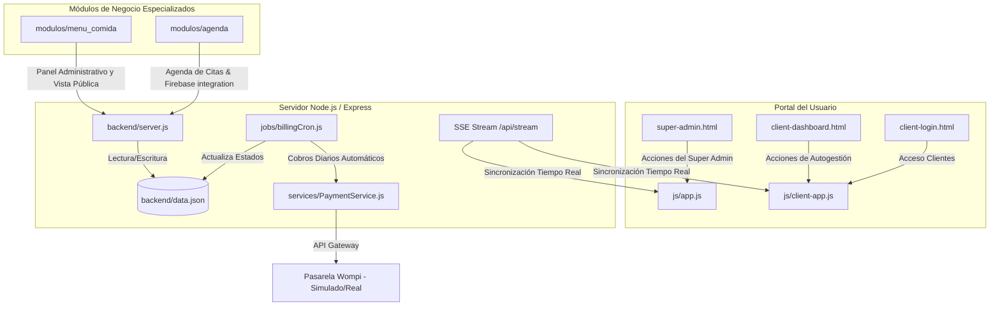

# AS Sierra Systems — Panel de Administración y Facturación

Este proyecto es una plataforma administrativa centralizada premium y de alto rendimiento para **AS Sierra Systems**, diseñada para gestionar negocios (clientes), módulos funcionales, facturación recurrente mensual, roles administrativos y notificaciones del sistema en tiempo real. 

El sistema está diseñado de forma modular, permitiendo a los clientes autogestionar su perfil y módulos contratados, mientras que los Super Administradores tienen control total sobre la plataforma, los precios, los cobros y la activación/suspensión automatizada de cuentas.

---

## 🏗️ Arquitectura del Sistema

La arquitectura está dividida de forma limpia en un frontend de SPA (Single Page Application) tradicional estilizado con CSS moderno y un backend en Node.js/Express sumamente optimizado que cuenta con persistencia de base de datos local y tareas en segundo plano (cron jobs).



---

## 📂 Estructura Detallada del Proyecto

A continuación se detalla la estructura física del proyecto para que cualquier desarrollador o IA localice componentes de inmediato:

```text
Administracion AS Sierra Systems/
├── backend/                             # --- LÓGICA DE BACKEND (Node.js) ---
│   ├── jobs/
│   │   └── billingCron.js               # Cron job diario a las 00:05 AM (Bogotá) para cobros recurrentes.
│   ├── modulos/                         # Módulos funcionales integrados
│   │   ├── agenda/                      # Sistema de Agenda/Citas integrado con Firebase Firestore.
│   │   └── menu_comida/                 # Sistema de Menú de Comida (administrador, cartas y configuración).
│   ├── services/
│   │   └── PaymentService.js            # Abstracción de pasarela Wompi (soporta modo simulación y real).
│   ├── data.json                        # Base de datos local simulada (Ignorada en Git, contiene credenciales).
│   ├── node_modules/                    # Dependencias de npm instaladas (Ignoradas en Git).
│   ├── package.json                     # Definición de dependencias y scripts de npm.
│   ├── package-lock.json                # Bloqueo de versiones exactas de las dependencias.
│   └── server.js                        # Servidor Express. APIs, SSE Stream, autenticación y CRUD.
│
├── frontend/                            # --- INTERFAZ DE USUARIO (Vanilla CSS/JS) ---
│   ├── assets/                          # Imágenes, fondos premium y recursos estáticos.
│   ├── css/
│   │   └── style.css                    # Estilos premium CSS. Paletas HSL, animaciones sutiles y diseño responsivo.
│   ├── js/
│   │   ├── app.js                       # Controlador del portal de Super Administrador (Admin Dashboard).
│   │   ├── client-app.js                # Controlador del portal de autogestión de Clientes.
│   │   └── consent.js                   # Sistema de banners de consentimiento de cookies/privacidad.
│   ├── client-dashboard.html            # Dashboard autogestionable de clientes.
│   ├── client-login.html                # Formulario de inicio de sesión de clientes.
│   ├── super-admin.html                 # Panel central del Super Administrador.
│   └── index.html                       # Página de redirección o inicio del portal.
│
└── .gitignore                           # Exclusiones de Git (node_modules, data.json, uploads, etc.).
```

---

## ⚙️ Componentes y Procesos Clave

### 1. Servidor Express y APIs (`backend/server.js`)
* **SSE (Server-Sent Events)**: En el endpoint `/api/stream` se gestiona una conexión SSE de una sola vía y persistente. El backend utiliza `broadcastUpdate()` cada vez que se guarda algún cambio en `data.json` para notificar al frontend. Esto permite una actualización y sincronización de datos instantánea sin hacer consultas repetitivas (polling).
* **Autenticación Basada en Tokens**:
  * **Admin**: Tokens prefijados con `adm_` válidos por 8 horas almacenados en memoria (`adminSessions`).
  * **Clientes**: Tokens dinámicos válidos por 8 horas en memoria (`clientTokens`).
  * El endpoint `/api/admin/refresh-token` permite renovar la sesión en caso de que el servidor se reinicie y los tokens en memoria se pierdan.
* **Seguridad de Datos**: Antes de responder al frontend en `/api/data`, el servidor filtra y enmascara campos sensibles (`clientPass`, `gateway_token` de Wompi) garantizando que ninguna información crítica se exponga en el cliente.

### 2. Tarea de Facturación Diaria (`backend/jobs/billingCron.js`)
Este script automatiza el cobro de suscripciones de manera desatendida.
* **Frecuencia**: Se ejecuta todas las noches a las **00:05 AM (Hora de Bogotá)**.
* **Cálculo de Tarifas**: `calculateMonthlyAmount` recorre los módulos activos del negocio en ese momento, busca su precio actual en la configuración del sistema (eliminando símbolos de divisa mediante expresiones regulares) y suma los valores para calcular la mensualidad exacta en COP.
* **Lógica de Suspensión Automatizada**:
  * Si el cobro a través de `PaymentService` es exitoso: Actualiza la fecha del próximo cobro (+30 días), marca el estado de la suscripción como `active`, registra la transacción y emite una notificación de éxito.
  * Si el cobro falla (tarjeta rechazada, fondos insuficientes, etc.): Cambia `subscription_status` a `suspended` y **desactiva inmediatamente la cuenta completa** (`status = 'inactive'`), suspendiendo tanto el portal del cliente como cualquier servicio público de sus módulos activos. Genera una notificación de error en el dashboard del Super Admin.

### 3. Servicio de Pagos (`backend/services/PaymentService.js`)
Abstracción limpia de la pasarela **Wompi** que permite alternar entre modo simulación y modo de producción real usando la variable `SIMULATION_MODE`.
* **Modo Simulado (`SIMULATION_MODE = true`)**:
  * Emula la tokenización de tarjetas devolviendo un token falso `sim_tok_...`.
  * Simula transacciones de cobro (`chargeWithToken`) con un **90% de probabilidad de éxito y un 10% de fallo por rechazo**, permitiendo verificar la estabilidad de los flujos de suspensión del Cron job en entornos locales.
* **Modo Real (`SIMULATION_MODE = false`)**:
  * Consume la API oficial de Wompi (`sandbox.wompi.co` o `production.wompi.co`).
  * Realiza los cargos en centavos (multiplicando el valor en COP por 100).
  * Valida firmas HMAC sha256 de webhooks enviados por Wompi para asegurar la integridad de las notificaciones de pago.

### 4. Portales del Frontend (`frontend/`)
Diseñado con una estética sumamente premium, moderna y con microinteracciones agradables:
* **`super-admin.html` / `app.js`**: Visualiza las métricas clave (Negocios activos, ingresos recurrentes mensuales proyectados (MRR), módulos más vendidos y tasa de fallos de pago). Permite crear/editar negocios, configurar sus contraseñas de portal, asociarles tokens de Wompi para pagos automáticos, administrar la lista de módulos y sus precios base, y gestionar usuarios internos de soporte.
* **`client-dashboard.html` / `client-app.js`**: Permite al negocio ver sus datos generales, cambiar su correo y contraseña de acceso, subir su logotipo/avatar (guardado en `frontend/uploads/avatars/`), revisar su estado de cuenta, ver sus fechas de corte y ver los módulos que tiene activos o suspendidos.

---

## 🛠️ Instalación y Configuración

Para poner en marcha el proyecto localmente, sigue estos pasos:

1. **Instalar Dependencias**:
   Ingresa a la carpeta `backend` e instala las dependencias de npm:
   ```bash
   cd backend
   npm install
   ```

2. **Configurar el archivo de datos**:
   Asegúrate de tener un archivo inicial `backend/data.json` con la estructura esperada si deseas inicializar desde cero. Ejemplo mínimo:
   ```json
   {
       "config": {
           "companyName": "AS Sierra Systems",
           "adminUser": "admin",
           "adminPass": "123456",
           "adminName": "Allenmar"
       },
       "businesses": [],
       "modules": [
           { "id": "agenda", "name": "Agenda de Citas", "price": "$ 95.000", "status": "active" },
           { "id": "menu_comida", "name": "Menú Digital", "price": "$ 50.000", "status": "active" }
       ],
       "users": [],
       "notifications": []
   }
   ```

3. **Variables de Entorno (Opcional, para producción Wompi)**:
   Si configuras `SIMULATION_MODE = false` en `backend/services/PaymentService.js`, define las siguientes variables:
   ```env
   WOMPI_PUBLIC_KEY=pub_prod_XXXXXX
   WOMPI_PRIVATE_KEY=prv_prod_XXXXXX
   WOMPI_EVENTS_SECRET=prod_events_secret
   PORT=3000
   ```

---

## ⚡ Comandos Útiles

* **Ejecutar el servidor en desarrollo**:
  ```bash
  # Desde la raíz del proyecto:
  node backend/server.js
  
  # O ingresando a la carpeta backend:
  cd backend
  npm start
  ```

* **Probar el Ciclo de Facturación Manual (Modo Simulado / Dry-Run)**:
  Puedes forzar la ejecución del cron job inmediatamente sin esperar a la medianoche para probar el comportamiento de los cobros automáticos:
  ```bash
  # Simular el proceso de cobro sin guardar cambios en la base de datos (Data protection)
  node backend/jobs/billingCron.js --dry-run
  
  # Ejecutar el cobro real (simulado/real según PaymentService) modificando estados en data.json
  node backend/jobs/billingCron.js
  ```

---

## 🧠 Guía para Inteligencias Artificiales y Desarrolladores Futuros

Si eres una IA trabajando en este repositorio, ten en cuenta las siguientes **reglas estrictas y principios de diseño**:

1. **Persistencia de Base de Datos (`data.json`)**:
   * El sistema no utiliza un motor SQL/NoSQL externo. La persistencia es un archivo JSON plano (`data.json`) en `backend/`.
   * Cualquier escritura debe ser atómica y ejecutarse llamando a `fs.writeFile` de manera controlada. 
   * Recuerda llamar siempre a `broadcastUpdate()` en el servidor después de guardar cambios en la DB para que los clientes conectados por SSE actualicen su UI en tiempo real de forma inmediata.

2. **Diseño de Interfaz Premium (CSS)**:
   * **No uses Tailwind CSS** a menos que el usuario lo solicite explícitamente. Mantén y complementa `frontend/css/style.css` usando CSS vanilla, variables personalizadas (tokens HSL) y diseños flexibles y fluidos.
   * La interfaz debe verse sumamente profesional: usa bordes redondeados consistentes (`border-radius: 12px` o `16px`), sombras suaves (`box-shadow`), gradientes armónicos y efectos dinámicos en los botones al hacer hover (transiciones de `0.3s ease`).

3. **Ciclo de Suspensión de Negocios**:
   * Si un cobro falla, el cron job cambia `biz.billing.subscription_status = 'suspended'` y `biz.status = 'inactive'`.
   * Al hacer esto, el portal de clientes (`client-dashboard.html`) debe restringir el acceso del usuario, mostrando una pantalla elegante de "Pago Requerido" (como se controla en `client-app.js` mediante la verificación del token en `/api/client/verify`).
   * Al restaurar el pago, asegúrate de devolver `biz.status = 'active'` y `biz.billing.subscription_status = 'active'`.

4. **Wompi y Seguridad de Tarjetas**:
   * **NUNCA** guardes números de tarjeta, fechas de vencimiento o códigos CVC en `data.json` o logs del servidor. En producción, la tokenización la realiza Wompi directamente en el navegador del usuario y solo manejamos el string del token resultante (`gateway_token`).